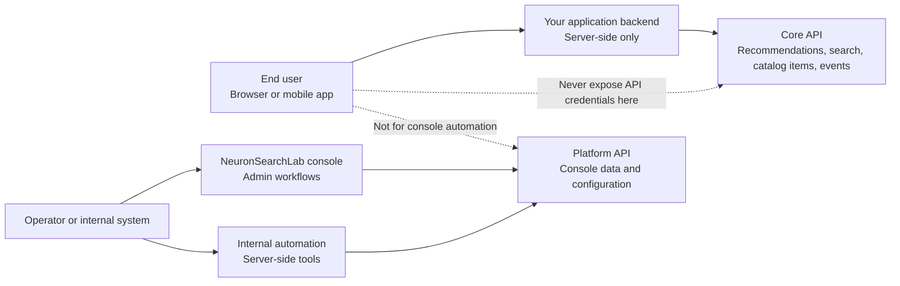

The NeuronSearchLab Core API is the data-plane surface for catalog ingestion, event ingestion, recommendation serving, and query-driven search.

<Info>
Use this API when your application backend needs to create catalog items, submit user events, or fetch recommendations for your app experience. If you are looking to automate console data, tenant configuration, training, analytics, billing, or other control-plane workflows, use the [Platform API](/api-reference/platform-api/introduction) instead.
</Info>

## Core API vs Platform API



The Core API belongs behind your own server-side boundary. Do not expose OAuth client credentials, access tokens, or direct Core API calls from a browser or mobile client.

## Base URLs

```bash
https://api.neuronsearchlab.com
https://auth.neuronsearchlab.com/oauth2/token
```

Use the Core API domain for resource calls and the auth domain for token exchange. The token endpoint is unauthenticated, lives on the auth subdomain, and is rate-limited independently from resource traffic.

## Authentication

Protected endpoints require a Bearer token:

```http
Authorization: Bearer <access_token>
```

Tokens are issued with OAuth 2.0 client credentials. Access tokens expire after 3600 seconds by default and should be refreshed by your backend before expiry.

Required scopes:

| Scope | Access |
| --- | --- |
| `neuronsearchlab-api/read` | Read recommendations, items, and events |
| `neuronsearchlab-api/write` | Create/update/delete items and submit events |

<Note>
The slash-delimited scope names are the current Cognito-issued values. Client libraries should treat the full string as opaque and split scopes only on spaces.
</Note>

## Object Model

Every resource response includes a read-only `object` discriminator.

| Object | Example ID | Description |
| --- | --- | --- |
| `item` | `7f3a2c9e` | Catalog item available for recommendation |
| `event` | `12345` | User interaction event |
| `recommendation` | `7f3a2c9e` | Ranked recommendation result |
| `list` | n/a | Cursor-paginated list envelope |

Resource IDs are opaque strings unless an endpoint documents a numeric server-generated ID. Contexts are console configuration records, not Core API resources; pass the numeric console context ID, for example `101`, when a recommendation request should use one.

## Timestamps

Datetime fields are Unix timestamps in integer seconds.

- Use `created` for resource creation time.
- Use `<verb>ed_at` for action-derived timestamps such as `occurred_at`.
- Use future-tense fields such as `expires_at` for future scheduled times.
- Do not use `created_at` in Core API payloads.

## Pagination

List endpoints use cursor-style pagination:

```http
GET /v1/items?limit=20&starting_after=7f3a2c9e
```

List responses use this envelope:

```json
{
  "object": "list",
  "data": [],
  "has_more": false,
  "next_cursor": null,
  "url": "/v1/items"
}
```

`limit` defaults to `20` and is capped at `100`.

## Errors

Errors use a consistent JSON envelope:

```json
{
  "error": {
    "type": "invalid_request_error",
    "code": "parameter_missing",
    "message": "Required parameter 'user_id' is missing."
  }
}
```

Common statuses are `400` for invalid requests, `401` for missing or invalid credentials, `403` for insufficient scope, `404` for missing resources, `409` for create conflicts, `429` for rate limits, and `500` for unexpected server errors.

## Endpoints

| Method | Path | Scope |
| --- | --- | --- |
| `POST` | `/v1/items` | `neuronsearchlab-api/write` |
| `GET` | `/v1/items` | `neuronsearchlab-api/read` |
| `GET` | `/v1/items/{item_id}` | `neuronsearchlab-api/read` |
| `POST` | `/v1/items/{item_id}` | `neuronsearchlab-api/write` |
| `PATCH` | `/v1/items/{item_id}` | `neuronsearchlab-api/write` |
| `DELETE` | `/v1/items/{item_id}` | `neuronsearchlab-api/write` |
| `POST` | `/v1/events` | `neuronsearchlab-api/write` |
| `GET` | `/v1/events` | `neuronsearchlab-api/read` |
| `GET` | `/v1/events/{event_id}` | `neuronsearchlab-api/read` |
| `GET` | `/v1/recommendations` | `neuronsearchlab-api/read` |
| `POST` | `/v1/search` | `neuronsearchlab-api/read` |

Each endpoint supports `OPTIONS` preflight with standard CORS headers.
