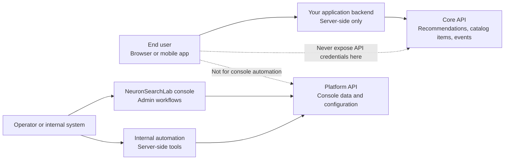

The Platform API is the control-plane surface behind the NeuronSearchLab console. Use it for tenant administration, console automation, and internal tools that need to read or mutate control-plane configuration.

<Info>
Use this API when you need console data, tenant administration, model and training workflows, analytics, billing, or internal automation. If you are looking to serve recommendations, ingest application events, or manage catalog items for your app experience, use the [Core API](/api-reference/introduction) instead.
</Info>

## Core API vs Platform API



The Platform API is for trusted console and automation workflows. It is not the serving path for end-user recommendation traffic.

## Base URL

```bash
https://console.neuronsearchlab.com/api
```

## Authentication

Platform routes accept either:

- a signed-in console session, or
- an API key in the `Authorization` header.

```http
Authorization: Bearer nsl_<prefix>_<token>
```

API keys are created in **Console > Platform API Keys** and are shown once. The server stores only a SHA-256 hash.

## Scopes

| Scope | Intended access |
| --- | --- |
| `admin` | Full tenant administration routes |
| `recommendations` | Recommendation proxy routes when enabled |
| `events` | Event configuration and event automation routes |
| `items` | Catalog item automation routes |

Most current Platform API routes require `admin`. Routes that support narrower keys document the required scope on each resource page.

## Error Format

Platform API errors return a simple JSON envelope:

```json
{
  "error": "Unauthorized"
}
```

Common statuses are `400`, `401`, `403`, `404`, and `500`.

<Note>
The Platform API uses a different error shape than the Core API. Core API integrations should rely on the structured `error.type` / `error.code` / `error.message` envelope documented in the [Core API introduction](/api-reference/introduction).
</Note>

## When To Use Each

Use the Core API for customer application traffic. Use the Platform API only for tenant administration, console automation, and internal tools that need to access console data or mutate control-plane configuration.
