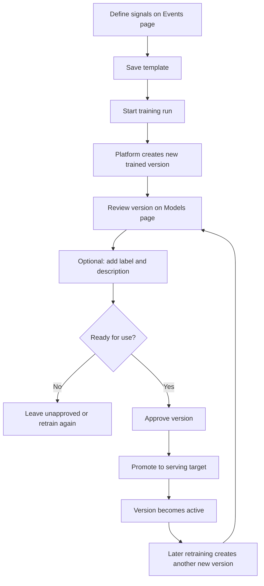

A trained version is the output of a training run. A registered model is the long-lived operator-facing track you use to organise versions, decide what should stay active, and manage ongoing rollout decisions.

The important mental model is:

- **Events** define what the system should learn from
- **Templates** package those signals into a repeatable training recipe
- **Training runs** create new trained versions
- **Models** are optional long-lived tracks you use to organise versions over time
- **Serving targets** decide which approved version is live for a given tenant or surface

---

## How To Think About Training

Users should think about training and retraining as a versioning workflow, not as editing one monolithic model in place.

1. Create or update a signal template on the **Events** page.
2. Start a training run from that template.
3. Let the platform create a **new trained version**.
4. Review the result on the **Models** page.
5. Optionally add a human-friendly label and description.
6. Approve the trained version when it is ready.
7. Promote it to a serving target when you want it live.
8. Repeat the same flow whenever you retrain.

That means retraining does **not** overwrite the previous result. It creates another version you can compare, approve, reject, or promote.

## Training And Retraining Flow

## System Name vs Human Label

Every trained version has two layers of identity:

- A **system name** generated from the template name and the training run identifier
- An optional **label** and **description** added by your team

Example:

- System name: `Engagement booster v2 · train-42-1712912345`
- Label: `Homepage recommender`
- Description: `Tighter freshness weighting for spring campaign`

The system name preserves provenance. The label and description make the version easier for operators to recognise later.

## Registered Models vs Trained Versions

Use these two concepts differently:

- **Trained versions** are the raw outputs of training runs
- **Registered models** are long-lived tracks you create when you want an explicit operator-owned model record for rollout, version management, or ongoing retraining policy

A common pattern is:

- Train several versions from one template
- Review and compare them
- Promote one version
- Later create a registered model if you want a named track for that recommendation strategy

## What The Models Page Shows

The Models page brings together:

- Successful trained versions from recent runs
- Approval state
- Serving targets
- Which version is active
- Registered models, if you use them as long-lived tracks

This lets you operate even if you are a brand-new account with no pre-existing model records.

---

## Approve A Trained Version

After a training run completes successfully, the new trained version has a status of **Pending**. You must approve it before it can be promoted.

1. Open [Console > Training Jobs](https://console.neuronsearchlab.com/training-jobs) or [Console > Models](https://console.neuronsearchlab.com/models).
2. Find the completed version and click **Approve**.
3. The version status updates to **Approved**.

Approving a version does not automatically change what is served. It makes that version eligible for promotion.

---

## Promote A Version To Production

Once approved, you can promote a version to replace what is currently live on a serving target.

1. Find the approved trained version.
2. Click **Promote to production**.
3. Choose the serving target you want to update.
4. The console will show the target status updating.
5. Once the target returns to a healthy state, the promoted version is live and subsequent recommendation requests use it.

You can promote a previous version at any time if you need to roll back.

---

## Active Version

The Models page shows which version is currently active on each serving target. That gives you a clear answer to:

- Which version is live?
- Where is it live?
- When was it last promoted?

If no version is active yet, the target remains unassigned until you promote one.

---

## Training run metrics

Each training run records a set of metrics at completion. Open a run from the Training Jobs page to view:

- Training job status and duration
- Final metrics (loss, accuracy, or custom metrics your training job reports)
- The run manifest, which records the configuration used

Use these metrics to compare versions and decide whether a new one is ready to approve or promote.

---

## Trigger A New Training Run

See the [Configuring Events and Signal Templates](/guides/events) guide for instructions on defining signals, saving templates, and creating the next trained version.
